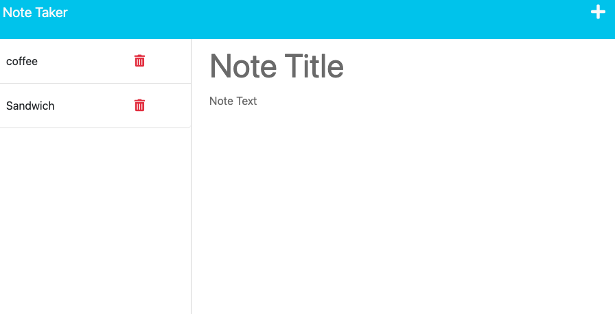

# Note Taker

## Table of Contents

- [Description](#description)
- [installation](#installation)
- [Usage](#usage)
- [License](#license)
- [Contributing](#contributing)
- [Tests](#tests)
- [Questions](#questions)

## Description

this is a Note Taker App that can be used to write and save notes. This application uses an EXPRESS.js back end and saves and retrieves note data from a JSON file. The user is presented with a landing page with a link to a note page. When the user enters a new note with title and text, the Save icon appears on the top of the page. When the note is saved, it appears on the left-hand column. The user has also an option to delete a specific note.

## Installation

node.js, EXPRESS, Heroku.

## Usage

Click on the plus icon to write a note, click on the save icon to add a note.

## License

Licensed under the [MIT](http://choosealicense.com/licenses/mit/) license.

## Contributing

## Tests

## Questions

[The URL of the GitHub profile](https://github.com/LizaS2022).
The URL of the deployed application.
